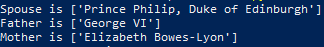

# WikiFamilyFinder
Automatically find familial relations of Wikipedia persons, if found in the infobox

Very simple, enter a url into the code:

And then just run it through your console, to output familial relations:

# Future Additions
Automatically output a family tree image.
Use NLP to find familial relations that are not found in the infobox
